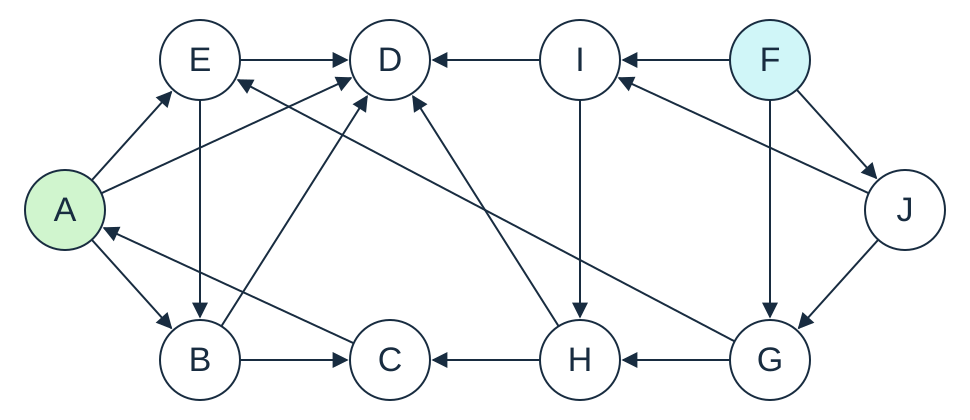
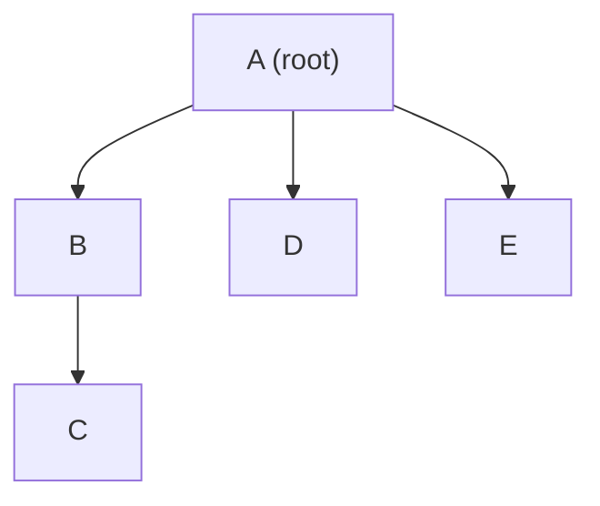
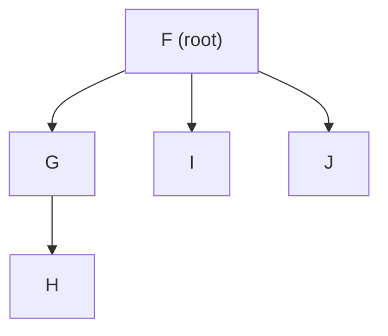
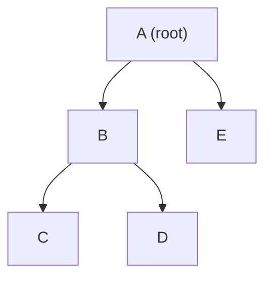
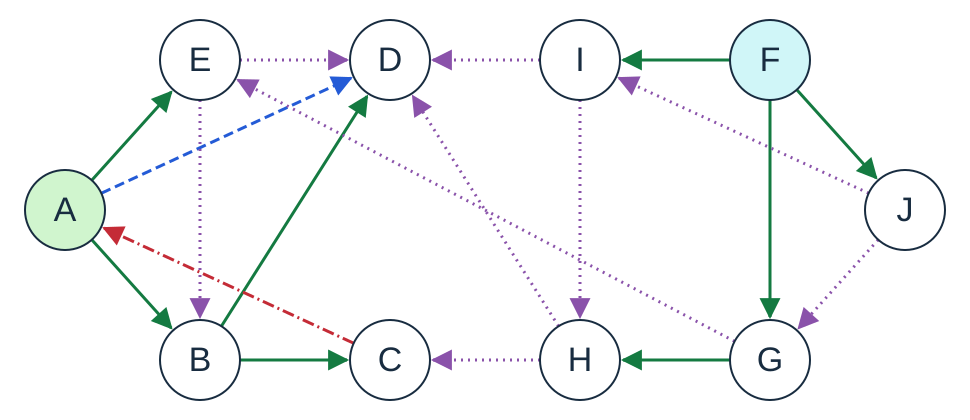
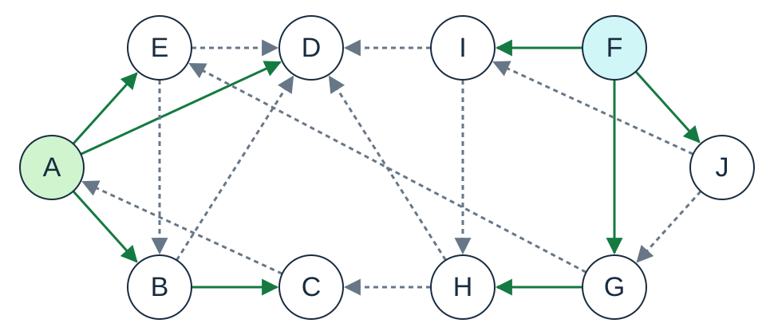

# Directed graph: breadth-first and depth-first traversals

## Purpose and prerequisites

Explore the exact ten-vertex, nineteen-arc directed graph from Topic 6's
**"Example graph for DFS and BFS"** slide. It contains cycles and vertices
that are unreachable from A, although the underlying undirected graph is connected. Compare **breadth-first search
(BFS)** and **depth-first search (DFS)**, and see how discovery creates a tree
or forest even when the original graph is not a tree.

Prerequisites: generic collections, maps, sets, stacks and queues.
DFS uses an explicit LIFO stack containing vertices directly; BFS uses a FIFO
queue. No recursion or stack entries containing neighbour iterators are used.
DFS marks a vertex when pushing it onto the current path; BFS marks it when
enqueuing it. It needs only JDK 17, with no
external libraries, downloads or other demo folders.

## Files and responsibilities

- `src/ds/Graph.java`: a small unweighted, simple directed graph using a sorted
  map of sorted neighbour sets.
- `src/ds/Traversals.java`: single-source searches and whole-graph forests;
  results contain discovery order and parent associations.
- `src/app/ExampleGraph.java`: constructs the exact graph from the theory slide.
- `src/app/Main.java`: compares four traversal results.
- `docs/theory-traversal-graph.svg`: the same topology and node arrangement as the slide.
- `tests/tests/ExampleChecks.java`: checks contracts, cycles, reachability,
  parent edges, shortest hop counts, and result independence.

## The graph



The diagram preserves the slide's node arrangement and arc directions. A is
highlighted in green and F in blue: these are the two forest roots when starting
vertices and neighbours are considered alphabetically. Crossings are not vertices.

| Vertex | Outgoing neighbours, alphabetically |
| --- | --- |
| A | B, D, E |
| B | C, D |
| C | A |
| D | None |
| E | B, D |
| F | G, I, J |
| G | E, H |
| H | C, D |
| I | D, H |
| J | G, I |

An arrow is one directed arc. For example, C -> A closes a cycle, and D is
reachable from A directly or via B. G -> E, H -> C, H -> D and I -> D connect
the two regions in the direction shown. They do not make F reachable from A.
No extra vertices or arcs have been added to the slide's graph.

Vertices and outgoing neighbours are processed alphabetically because
`ExampleGraph.create()` supplies `Comparator.naturalOrder()`.

## BFS: use a queue

1. Mark A and enqueue it.
2. Dequeue A, visit it, and enqueue its previously unmarked neighbours B, D, E.
3. Dequeue B and enqueue C. D is already marked, so it is not enqueued again.
4. Process D, E and C. E's neighbours B and D are already marked;
   C's arc back to A also finds an already marked vertex.

The order is **A, B, D, E, C**. Marking on enqueue prevents duplicate work when
two arcs reach the same vertex. The parent entries are B=A, D=A, E=A, C=B.
Following them backwards reconstructs a path from the source. Its number of
arcs is minimal for a single-source BFS; this does not minimise arbitrary
weighted costs. Use the Dijkstra example for that problem.

## DFS: keep the current path on a stack

`Deque<V> path = new ArrayDeque<>();` provides the stack. `push` adds a vertex,
`peek` reads the top without removing it, and `pop` removes it. Entries are
vertices only. The stack represents the path currently being explored.

1. Mark and visit the source, then push it.
2. Look at the top vertex with `peek`.
3. Find its first unvisited neighbour in alphabetical order. If one exists,
   mark and visit it, record its parent, and push **only that neighbour**.
4. If no unvisited neighbour remains, pop the top to backtrack.
5. Repeat until the stack is empty.

The trace lists the stack **bottom to top**, with the top on the right:

| Action | Stack afterwards | Visit order so far |
| --- | --- | --- |
| Mark, visit and push A | [A] | [A] |
| Peek A; discover and push B | [A, B] | [A, B] |
| Peek B; discover and push C | [A, B, C] | [A, B, C] |
| Peek C; A is marked, so pop C | [A, B] | [A, B, C] |
| Peek B; C is marked, discover and push D | [A, B, D] | [A, B, C, D] |
| Peek D; no neighbours, so pop D | [A, B] | [A, B, C, D] |
| Peek B; all neighbours marked, so pop B | [A] | [A, B, C, D] |
| Peek A; B and D marked, discover and push E | [A, E] | [A, B, C, D, E] |
| Peek E; B and D marked, so pop E | [A] | [A, B, C, D, E] |
| Peek A; all neighbours marked, so pop A | [] | [A, B, C, D, E] |

Each vertex is pushed once and its parent is recorded once. The stack has no
repeated vertices and there are no provisional parents. Neighbours are examined
in their normal alphabetical order; no reversal is needed because only one
neighbour is pushed at a time. `null` means no unvisited neighbour was found;
the graph's non-null vertex contract makes that sentinel unambiguous.

The order is **A, B, C, D, E**. D has parent B, although A also has a direct arc
to D. DFS does not guarantee a shortest path. This is the explicit-stack approach
used in class; it reproduces the same discovery order and parent forest as
recursive DFS with the same neighbour order.

## One source versus a complete forest

`breadthFirst(graph, source)` and `depthFirst(graph, source)` visit only vertices
reachable from that source. From A they visit A, B, C, D and E.

`breadthFirstForest(graph)` and `depthFirstForest(graph)` iterate through all
vertices and start a new search at each unmarked one, reusing the marked set.
After the first search finishes, the next unmarked vertex is F. Arcs from the
second region into the first encounter already marked vertices.

| Traversal | Complete discovery order | Roots |
| --- | --- | --- |
| DFS forest | A, B, C, D, E, F, G, H, I, J | A, F |
| BFS forest | A, B, D, E, C, F, G, I, J, H | A, F |

These are the orders in the theory presentation. In both forests G, I and J
have parent F, and H has parent G. The first region has the parents explained
above; in particular D has parent B in DFS and A in BFS.

A root has **no parent entry**. Every other discovered vertex has exactly one.
Parent maps print `child=parent`; the corresponding tree arc points from parent
to child. Roots A and F do **not** mean two disconnected components: ignoring
arc directions makes the whole example connected. A full BFS forest does not
give distances from a common source; it continues with an existing marked set.
A new single-source search from F, with fresh marks, can reach all ten vertices.

## Resulting traversal forests

Each forest contains **two trees**, rooted at A and F. Every arrow below is
a recorded parent-to-child arc. Non-tree arcs from the original graph are omitted.
The two trees are drawn separately for readability; together they form one forest.

### BFS forest

Tree rooted at A:



Tree rooted at F:



BFS discovers B, D and E directly from A. C is discovered from B.
In the second tree, F discovers G, I and J; G discovers H.

### DFS forest

Tree rooted at A:



Tree rooted at F:


DFS follows A -> B -> C, backtracks to B, then discovers D before returning
to A and discovering E. **D is the only vertex whose parent differs**:
A in BFS, B in DFS. The tree rooted at F has the same parent arcs in both
forests, although discovery order differs: F, G, I, J, H in BFS and
F, G, H, I, J in DFS. The drawing shows parent relationships, not a timeline.

## Forests with all original arcs

The forest diagrams above show parent arcs only. The following drawings overlay
**all nineteen original arcs**, preserving the arrangement used in the theory slide.
Only the tree arcs form the forest; adding the other arcs gives back the original
graph, including its cycle. Roots A and F retain the slide's green and blue fills.

### DFS arc classification



| Arc type | Appearance | Meaning in the completed DFS forest |
| --- | --- | --- |
| Tree | Green, solid | The source is the recorded parent of the destination. |
| Forward | Blue, dashed | To a proper descendant, but not a tree arc. |
| Back | Red, dash-dot | To an ancestor. |
| Cross | Purple, dotted | Neither endpoint is an ancestor of the other. |

Check the parent relation first: tree arcs also point to descendants, but are
classified as tree arcs rather than forward arcs. Ancestor relationships must
come from this **same completed DFS forest**, not from alphabetical labels or
geometric positions. A cross arc can connect different branches of one tree or
two different trees.

Here A -> D is forward because D is reached through A -> B -> D; C -> A is
back because A is an ancestor of C. E -> B is cross despite both vertices being
in the tree rooted at A. G -> E crosses between the two trees.

### BFS tree and non-tree arcs



Green solid arrows are BFS parent arcs; grey dashed arrows are all remaining
arcs. The four-way classification above is the DFS classification taught in
the presentation; it is not applied to BFS here. In particular A -> D becomes
a tree arc in BFS, while B -> D becomes a non-tree arc.

### Complete arc-by-arc comparison

| Original arc | DFS classification | BFS classification |
| --- | --- | --- |
| A → B | Tree | Tree |
| A → D | Forward | Tree |
| A → E | Tree | Tree |
| B → C | Tree | Tree |
| B → D | Tree | Non-tree |
| C → A | Back | Non-tree |
| E → B | Cross | Non-tree |
| E → D | Cross | Non-tree |
| F → G | Tree | Tree |
| F → I | Tree | Tree |
| F → J | Tree | Tree |
| G → E | Cross | Non-tree |
| G → H | Tree | Tree |
| H → C | Cross | Non-tree |
| H → D | Cross | Non-tree |
| I → D | Cross | Non-tree |
| I → H | Cross | Non-tree |
| J → G | Cross | Non-tree |
| J → I | Cross | Non-tree |

DFS has 8 tree arcs, 1 forward arc, 1 back arc and 9 cross arcs.
BFS has 8 tree arcs and 11 non-tree arcs. Each forest has 10 vertices and
2 roots, hence 10 - 2 = 8 parent arcs.

## Contracts and design choices

- Vertices and the comparator must be non-null. Invalid arguments throw
  `IllegalArgumentException` through simple explicit conditionals.
- The comparator must be consistent with `equals`; vertex hashing must also be
  consistent with `equals`. Do not mutate fields used for these operations while
  a vertex is stored.
- `addEdge` creates missing endpoints. A duplicate arc or a self-loop returns
  false; a rejected self-loop does not create a missing vertex. Reverse arcs are
  independent: adding A -> B does not add B -> A.
- Vertex and neighbour sets are read-only live views. Unknown neighbour lookup
  or a single-source traversal from an unknown vertex throws
  `IllegalArgumentException`.
- Empty graphs have empty forests. Searching an existing isolated vertex
  returns just that vertex and an empty parent map.
- Results are unmodifiable snapshots of the order and parent collections.
  Vertex objects themselves are shared. Later graph changes do not alter an
  existing result. Parent iteration retains discovery order for reproducible output.
- Do not change the graph while a traversal is running. This example materialises
  results; it does not expose traversal iterators.
- `Result` is a Java 17 record: a small data carrier with `order()` and `parent()`
  accessors. Its constructor makes defensive collection copies. The algorithms
  provide the parent-forest invariant; the public record constructor does not
  validate an arbitrary caller-provided forest.

## Costs and limitations

Let V be the number of vertices and E the number of directed arcs. The graph
stores O(V + E) entries. Insertion and adjacency lookup use sorted collections,
so lookups take O(log V), assuming constant-time comparisons.

BFS takes **O(V log(V + 1) + E)** expected time with this representation,
assuming expected O(1) hash-based marking. With indexed adjacency lists and
constant-time marks, its familiar bound is O(V + E).

This deliberately simple DFS searches the top vertex's neighbours **from the
beginning** each time it returns to that vertex. It does not remember an iterator
or a neighbour index. Thus its time is not necessarily O(V + E): if d(v) is a
vertex's out-degree, a bound is **O(V log(V + 1) + sum_v d(v)(d(v) + 1))** expected
time, and hence O(V log(V + 1) + VE) for a simple graph. A vertex is reconsidered
once per child in the DFS tree and once more before being popped. Each such
search may scan its whole neighbour set. There are O(V) such searches overall,
so the sorted-map lookups contribute O(V log(V + 1)).

This choice keeps the code close to the classroom explanation. Remembering the
position reached in each neighbour list would avoid rescanning, but is not used
in this example. A single-source traversal performs this work only for reachable
vertices; map lookups still depend on the size of the whole graph.

Both traversals use **O(V) auxiliary space**, including marks, results and pending
work. The DFS stack contains only the current path, with each vertex appearing
at most once. It does not consume Java's recursive call stack, so long paths do
not cause recursive stack overflow. Copying the result collections takes O(V).

## Run and check

Open this demo folder in VS Code and run `app.Main`, or use a terminal in this
folder. The scripts compile with `--release 17`, enable compiler warnings and
reject warnings as errors.

Windows (PowerShell):

```powershell
.\run.cmd
.\run.cmd test
```

macOS or Linux:

```bash
bash run.sh
bash run.sh test
```

From the enclosing Topic06 folder, select the example with
`bash run.sh Demo01GraphTraversals` or `.\run.cmd Demo01GraphTraversals`.

## Expected output

```text
Directed graph (outgoing neighbours):
A -> [B, D, E]
B -> [C, D]
C -> [A]
D -> []
E -> [B, D]
F -> [G, I, J]
G -> [E, H]
H -> [C, D]
I -> [D, H]
J -> [G, I]

BFS from A: [A, B, D, E, C]
Parents: {B=A, D=A, E=A, C=B}

DFS from A: [A, B, C, D, E]
Parents: {B=A, C=B, D=B, E=A}

BFS forest: [A, B, D, E, C, F, G, I, J, H]
Parents: {B=A, D=A, E=A, C=B, G=F, I=F, J=F, H=G}

DFS forest: [A, B, C, D, E, F, G, H, I, J]
Parents: {B=A, C=B, D=B, E=A, G=F, H=G, I=F, J=F}
Parent entries mean child=parent; roots have no entry.
BFS minimises the number of arcs from one source, not weighted cost.
```

## Suggested classroom questions

1. Why is D discovered by different parents in BFS and DFS?
   Why do both forests have roots A and F despite the graph being weakly connected?
2. What would happen at C -> A if there were no marked set?
3. Why does DFS push only one unvisited neighbour before examining the new top?
   What would change if it marked all of A's neighbours at once?
4. Add E -> F. Which vertices become reachable from A, and how many forest roots remain?
5. Reverse the comparator. Which results change, and which reachability facts remain?
6. In this graph, does the DFS parent chain to D have minimum length?

The automated checks compare BFS hop counts against an independent
Floyd-Warshall calculation on small random directed graphs. They also verify
that parent arcs exist, parents precede their children, searches do not repeat
vertices, and both traversals reach the same vertices from each source.
