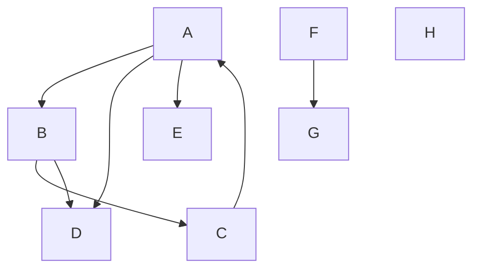

# Directed graph: breadth-first and depth-first traversals

## Purpose and prerequisites

Explore a small graph containing a cycle, multiple paths to the same vertex,
a separate component and an isolated vertex. Compare **breadth-first search
(BFS)** and **depth-first search (DFS)**, and see how discovery creates a tree
or forest even when the original graph is not a tree.

Prerequisites: generic collections, maps, sets, queues and recursion. This example
follows Topic 6's traversal pseudocode: DFS uses the call stack; BFS uses a FIFO
queue and marks vertices when enqueuing them. It needs only JDK 17, with no
external libraries, downloads or other demo folders.

## Files and responsibilities

- `src/ds/Graph.java`: a small unweighted, simple directed graph using a sorted
  map of sorted neighbour sets.
- `src/ds/Traversals.java`: single-source searches and whole-graph forests;
  results contain discovery order and parent associations.
- `src/app/Main.java`: constructs the graph and compares four results.
- `tests/tests/ExampleChecks.java`: checks contracts, cycles, reachability,
  parent edges, shortest hop counts, and result independence.

## The graph



An arrow is one directed arc. `C -> A` closes a cycle, and D can be reached
from A directly or via B. F and G form a separate component; H is isolated.
Vertices and outgoing neighbours are processed alphabetically because Main
supplies `Comparator.naturalOrder()`.

## BFS: use a queue

1. Mark A and enqueue it.
2. Dequeue A, visit it, and enqueue its previously unmarked neighbours B, D, E.
3. Dequeue B and enqueue C. D is already marked, so it is not enqueued again.
4. Process D, E and C. C's arc back to A finds an already marked vertex.

The order is **A, B, D, E, C**. Marking on enqueue prevents duplicate work when
two arcs reach the same vertex. The parent entries are B=A, D=A, E=A, C=B.
Following them backwards reconstructs a path from the source. Its number of
arcs is minimal for a single-source BFS; this does not minimise arbitrary
weighted costs. Use the Dijkstra example for that problem.

## DFS: use recursion

DFS marks and visits A, then recursively explores B. B discovers C, whose
arc to A is ignored because A is marked. After C returns, B discovers D.
Finally control returns to A, which discovers E.

The order is **A, B, C, D, E**. D now has parent B, although A also has a direct
arc to D. DFS does not guarantee a shortest path. Each recursive call remembers
which neighbours remain to be examined; returning resumes that work.

## One source versus a complete forest

`breadthFirst(graph, source)` and `depthFirst(graph, source)` visit only vertices
reachable from that source. Starting at A does not visit F, G or H.

`breadthFirstForest(graph)` and `depthFirstForest(graph)` iterate through all
vertices and start a new search at each unmarked one, reusing the marked set.
The example therefore has roots A, F and H. A root has **no parent entry**.
All other discovered vertices have exactly one parent. Parent maps print
`child=parent`; the corresponding tree arc points from parent to child.

In a directed graph, forest roots do not generally identify weakly or strongly
connected components. For example, with the single arc B -> A and alphabetical
root order, the forest has two roots even though the underlying undirected
graph is connected. Nor does a full BFS forest give distances from one common
source: each search starts at its own root.

## Contracts and design choices

- Vertices and the comparator must be non-null. Invalid arguments throw
  `IllegalArgumentException` through simple explicit conditionals.
- The comparator must be consistent with `equals`; vertex hashing must also be
  consistent with `equals`. Do not mutate fields used for these operations while
  a vertex is stored.
- `addEdge` creates missing endpoints. A duplicate arc or a self-loop returns
  false; a rejected self-loop does not create a missing vertex. Reverse arcs are
  independent: adding A -> B does not add B -> A.
- Vertex and neighbour sets are read-only live views. Unknown neighbour lookup
  or a single-source traversal from an unknown vertex throws
  `IllegalArgumentException`.
- Empty graphs have empty forests. Searching an existing isolated vertex
  returns just that vertex and an empty parent map.
- Results are unmodifiable snapshots of the order and parent collections.
  Vertex objects themselves are shared. Later graph changes do not alter an
  existing result. Parent iteration retains discovery order for reproducible output.
- Do not change the graph while a traversal is running. This example materialises
  results; it does not expose traversal iterators.
- `Result` is a Java 17 record: a small data carrier with `order()` and `parent()`
  accessors. Its constructor makes defensive collection copies. The algorithms
  provide the parent-forest invariant; the public record constructor does not
  validate an arbitrary caller-provided forest.

## Costs and limitations

Let V be the number of vertices and E the number of directed arcs. The graph
stores O(V + E) entries. Insertion and adjacency lookup use sorted collections,
so lookups take O(log V), assuming constant-time comparisons.

A complete traversal takes **O(V log(V + 1) + E)** expected time with this
representation, assuming expected O(1) hash-based marking. With indexed
adjacency lists and constant-time marks, the familiar bound is O(V + E).
A single-source traversal scans only reachable vertices and their outgoing arcs,
but its map lookups still depend on the size of the whole graph.

The marked set, order, parent map and pending work require O(V) extra space;
copying the result is O(V). BFS uses a queue; DFS uses up to O(V) recursive calls.
A very long path can overflow Java's call stack. The recursive form is intentional
here because it matches the theory and keeps the small example easy to follow.

## Run and check

Open this demo folder in VS Code and run `app.Main`, or use a terminal in this
folder. The scripts compile with `--release 17`, enable compiler warnings and
reject warnings as errors.

Windows (PowerShell):

```powershell
.\run.cmd
.\run.cmd test
```

macOS or Linux:

```bash
bash run.sh
bash run.sh test
```

From the enclosing Topic06 folder, select the example with
`bash run.sh Demo01GraphTraversals` or `.\run.cmd Demo01GraphTraversals`.

## Expected output

```text
Directed graph (outgoing neighbours):
A -> [B, D, E]
B -> [C, D]
C -> [A]
D -> []
E -> []
F -> [G]
G -> []
H -> []

BFS from A: [A, B, D, E, C]
Parents: {B=A, D=A, E=A, C=B}

DFS from A: [A, B, C, D, E]
Parents: {B=A, C=B, D=B, E=A}

BFS forest: [A, B, D, E, C, F, G, H]
Parents: {B=A, D=A, E=A, C=B, G=F}

DFS forest: [A, B, C, D, E, F, G, H]
Parents: {B=A, C=B, D=B, E=A, G=F}
Parent entries mean child=parent; roots have no entry.
BFS minimises the number of arcs from one source, not weighted cost.
```

## Suggested classroom questions

1. Why is D discovered by different parents in BFS and DFS?
2. What would happen at C -> A if there were no marked set?
3. Why must BFS mark a vertex when enqueuing it?
4. Add E -> F. Which vertices now become reachable from A? What happens to H?
5. Reverse the comparator. Which results change, and which reachability facts remain?
6. In this graph, does the DFS parent chain to D have minimum length?

The automated checks compare BFS hop counts against an independent
Floyd-Warshall calculation on small random directed graphs. They also verify
that parent arcs exist, parents precede their children, searches do not repeat
vertices, and both traversals reach the same vertices from each source.
