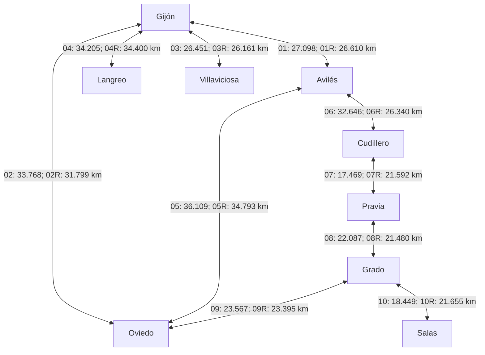
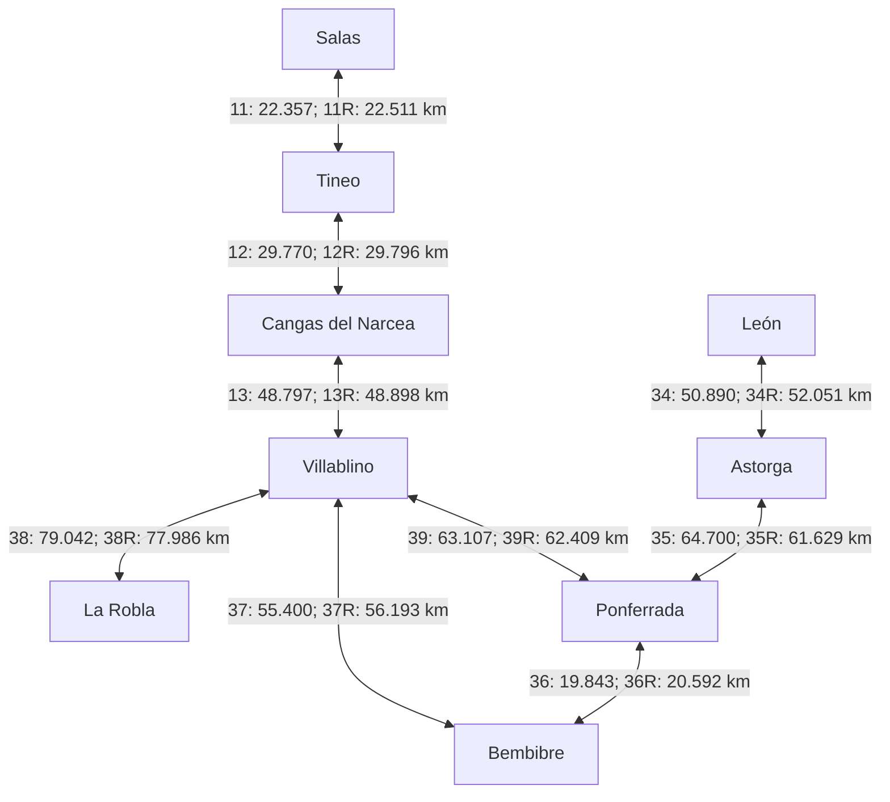
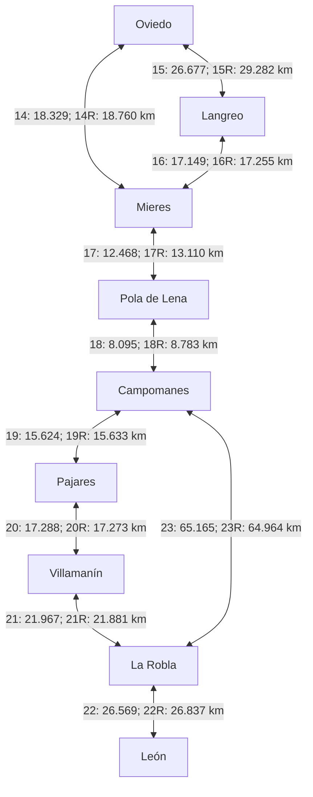
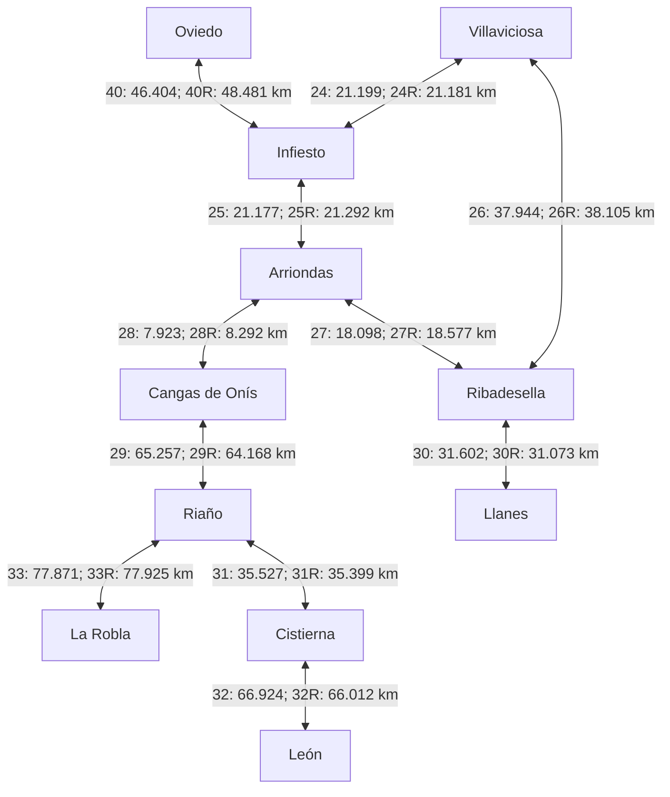
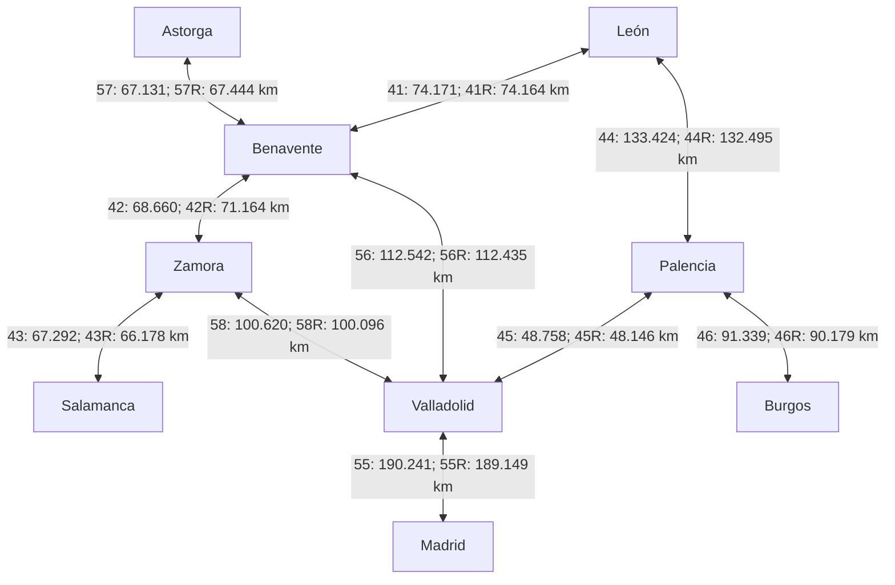
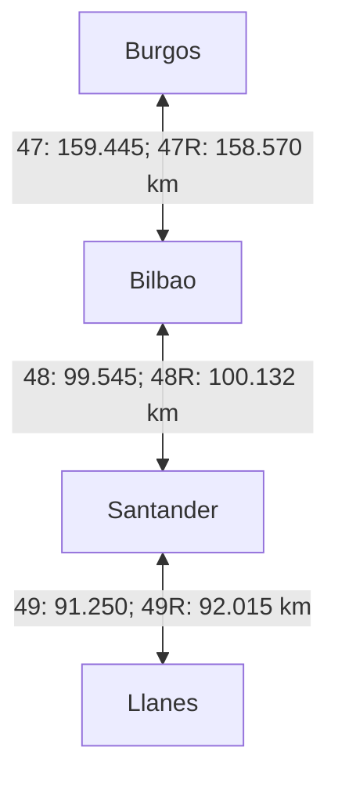
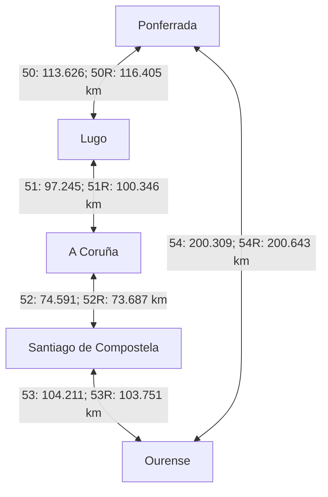
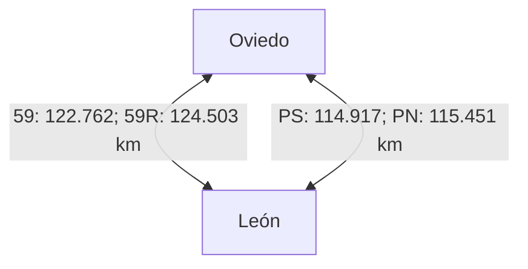

# Road navigation: shortest paths and temporary incidents

## Goal and prerequisites

Choose an origin and destination, compute a route, remove a road, and ask
Dijkstra for an alternative. Restore the road, give it a large temporary weight,
and repeat. The program prints the actual road alternatives selected, their
physical kilometres and the routing cost separately.

Read Topic 6's adjacency-map representation, nonnegative weights, relaxation
and Dijkstra invariant first. Maps, sets, comparators and priority queues come
from earlier topics. `WeightedGraph` and its linear and heap Dijkstra algorithms
are unchanged. The new navigation layer supplies the roads and incident state.

<!-- BEGIN GENERATED ROAD GRAPH -->
## Graph of the bundled road network

The following diagrams cover **all 42 localities and all 120 directed road
alternatives** in `data/northern-spain.json`. They are schematic graphs,
not geographic maps: line shapes and positions do not represent road geometry.
Localities shared by panels refer to the same vertex in the one complete graph.

**Legend:** a node is a locality reference point. For readability, each
double-headed connection groups **two separate directed arcs**. Its label
uses compact IDs: `01` means `road-01`, `01R` means `road-01-reverse`.
`PS` and `PN` mean `pajares-south` and `pajares-north`. Each ID is followed
by its own physical distance in kilometres, rounded to three decimals.
Look up the ID in the table for its exact direction, road references and
incident tags; label order is not a left-to-right or top-to-bottom direction.
The paired arcs can differ in both distance and road references.

At baseline, **weight = kilometres**. With an incident, **weight = kilometres
+ penalty**; a closure removes the arc instead. These diagrams show the original
network with zero penalties. Penalties are teaching cost units, not minutes.
Distances are the saved map-derived snapshot, not live measurements.

An arc may cover several roads and pass through other places without a graph
vertex there. A line crossing is not a junction unless there is a labelled node.
Parallel connections between Oviedo and Leon represent distinct route alternatives.
For geographic road shapes and the five incident scenarios, use the offline
HTML viewer described below.

### Central coast and western Asturias



| Arc ID | Direction | Road references | Distance (km) | Incident tags |
| --- | --- | --- | ---: | --- |
| `road-01` | Gijón → Avilés | GJ-81, A-8, AI-81, AS-392 | 27.098 | None |
| `road-01-reverse` | Avilés → Gijón | N-632a, AS-392, AI-81, A-8, GJ-81 | 26.610 | None |
| `road-02` | Gijón → Oviedo | GJ-81, A-8, A-66R, A-63, O-12, N-630 | 33.768 | None |
| `road-02-reverse` | Oviedo → Gijón | N-630, O-11, A-66, A-66R, A-8, GJ-81 | 31.799 | None |
| `road-03` | Gijón → Villaviciosa | N-632, A-8 | 26.451 | None |
| `road-03-reverse` | Villaviciosa → Gijón | AS-380, N-632, A-8 | 26.161 | None |
| `road-04` | Gijón → Langreo | AS-I, AS-117, AS-117a, AS-269, AS-376, LA-3 | 34.205 | None |
| `road-04-reverse` | Langreo → Gijón | LA-3, AS-376, AS-117a, AS-269, AS-I | 34.400 | None |
| `road-05` | Avilés → Oviedo | N-632a, AS-392, AI-81, A-8, A-66R, A-66, A-63, O-12, N-630 | 36.109 | None |
| `road-05-reverse` | Oviedo → Avilés | N-630, O-11, A-66, A-66R, A-8, AI-81, AS-392 | 34.793 | None |
| `road-06` | Avilés → Cudillero | N-632a, AS-17, N-632, A-8, CU-3, CU-2 | 32.646 | None |
| `road-06-reverse` | Cudillero → Avilés | CU-2, N-632, A-8, AS-237 | 26.340 | None |
| `road-07` | Cudillero → Pravia | CU-2, N-632, AS-16, AS-347, PV-4 | 17.469 | None |
| `road-07-reverse` | Pravia → Cudillero | PV-4, AS-368, AS-347, AS-16, A-8, CU-3, CU-2 | 21.592 | None |
| `road-08` | Pravia → Grado | PV-4, AS-368, AS-347, AS-16, N-634 | 22.087 | None |
| `road-08-reverse` | Grado → Pravia | N-634, AS-16, AS-347, PV-4 | 21.480 | None |
| `road-09` | Grado → Oviedo | N-634, A-63, N-630, O-12 | 23.567 | None |
| `road-09-reverse` | Oviedo → Grado | O-12, N-630, N-634 | 23.395 | None |
| `road-10` | Grado → Salas | N-634, A-63, N-634a | 18.449 | None |
| `road-10-reverse` | Salas → Grado | N-634a, N-634 | 21.655 | None |

### Western mountains and El Bierzo



| Arc ID | Direction | Road references | Distance (km) | Incident tags |
| --- | --- | --- | ---: | --- |
| `road-11` | Salas → Tineo | N-634a, AS-216 | 22.357 | None |
| `road-11-reverse` | Tineo → Salas | AS-216, N-634, N-634a | 22.511 | None |
| `road-12` | Tineo → Cangas del Narcea | AS-215, AS-15, AS-213 | 29.770 | None |
| `road-12-reverse` | Cangas del Narcea → Tineo | AS-213, AS-15, AS-215 | 29.796 | None |
| `road-13` | Cangas del Narcea → Villablino | AS-213, LE-497, CL-626 | 48.797 | None |
| `road-13-reverse` | Villablino → Cangas del Narcea | LE-3309, CL-626, LE-497, AS-213 | 48.898 | None |
| `road-34` | León → Astorga | LE-30, AP-71, N-6 | 50.890 | None |
| `road-34-reverse` | Astorga → León | N-120a, N-120A, LE-420, AP-71, LE-20 | 52.051 | None |
| `road-35` | Astorga → Ponferrada | LE-133, LE-6425, A-6, N-6 | 64.700 | None |
| `road-35-reverse` | Ponferrada → Astorga | N-6, A-6 | 61.629 | None |
| `road-36` | Ponferrada → Bembibre | N-6, A-6, LE-5312 | 19.843 | None |
| `road-36-reverse` | Bembibre → Ponferrada | LE-5312, N-6, A-6 | 20.592 | None |
| `road-37` | Bembibre → Villablino | LE-5312, N-6, LE-463, CL-631, LE-3308 | 55.400 | None |
| `road-37-reverse` | Villablino → Bembibre | LE-3308, CL-631, LE-463, N-6, LE-5312 | 56.193 | None |
| `road-38` | Villablino → La Robla | CL-626, AP-66 | 79.042 | AP-66 |
| `road-38-reverse` | La Robla → Villablino | N-630, CL-626, AP-66 | 77.986 | AP-66 |
| `road-39` | Villablino → Ponferrada | LE-3308, CL-631 | 63.107 | None |
| `road-39-reverse` | Ponferrada → Villablino | CL-631, LE-3308 | 62.409 | None |

### Central Asturias and the mountain passes



| Arc ID | Direction | Road references | Distance (km) | Incident tags |
| --- | --- | --- | ---: | --- |
| `road-14` | Oviedo → Mieres | O-12, A-66 | 18.329 | None |
| `road-14-reverse` | Mieres → Oviedo | A-66, O-12 | 18.760 | None |
| `road-15` | Oviedo → Langreo | N-630, O-11, A-66, O-14, A-64, AS-17, AS-117, AS-117a, AS-269, AS-376, LA-3 | 26.677 | None |
| `road-15-reverse` | Langreo → Oviedo | LA-3, AS-376, AS-117a, AS-269, AS-17, A-64, A-66, A-63, O-12, N-630 | 29.282 | None |
| `road-16` | Langreo → Mieres | LA-3, AS-376, AS-117a, AS-269, AS-117, AS-I | 17.149 | None |
| `road-16-reverse` | Mieres → Langreo | AS-I, AS-117, AS-117a, AS-269, AS-376, LA-3 | 17.255 | None |
| `road-17` | Mieres → Pola de Lena | MI-2, A-66, LN-1, AS-375 | 12.468 | None |
| `road-17-reverse` | Pola de Lena → Mieres | AS-242, N-630, LN-1, A-66 | 13.110 | None |
| `road-18` | Pola de Lena → Campomanes | AS-242, N-630, LN-1, A-66 | 8.095 | None |
| `road-18-reverse` | Campomanes → Pola de Lena | N-630, A-66, LN-1, AS-375 | 8.783 | None |
| `road-19` | Campomanes → Pajares | N-630 | 15.624 | None |
| `road-19-reverse` | Pajares → Campomanes | N-630 | 15.633 | None |
| `road-20` | Pajares → Villamanín | N-630, LE-3505 | 17.288 | N-630-Pajares |
| `road-20-reverse` | Villamanín → Pajares | LE-3505, N-630 | 17.273 | N-630-Pajares |
| `road-21` | Villamanín → La Robla | LE-3505, LE-3503, N-630, CL-626 | 21.967 | None |
| `road-21-reverse` | La Robla → Villamanín | N-630, LE-3505 | 21.881 | None |
| `road-22` | La Robla → León | N-630, N-630A | 26.569 | None |
| `road-22-reverse` | León → La Robla | N-630, CL-626 | 26.837 | None |
| `road-23` | Campomanes → La Robla | N-630, A-66, CL-626 | 65.165 | None |
| `road-23-reverse` | La Robla → Campomanes | N-630, CL-626, AP-66, A-66 | 64.964 | AP-66 |

### Eastern Asturias and eastern Leon



| Arc ID | Direction | Road references | Distance (km) | Incident tags |
| --- | --- | --- | ---: | --- |
| `road-24` | Villaviciosa → Infiesto | AS-380, AS-255, N-634, N-634a | 21.199 | None |
| `road-24-reverse` | Infiesto → Villaviciosa | N-634a, N-634, AS-255, VV-16 | 21.181 | None |
| `road-25` | Infiesto → Arriondas | N-634a, N-634 | 21.177 | None |
| `road-25-reverse` | Arriondas → Infiesto | N-634, N-634a | 21.292 | None |
| `road-26` | Villaviciosa → Ribadesella | AS-380, N-632, A-8 | 37.944 | None |
| `road-26-reverse` | Ribadesella → Villaviciosa | N-632, A-8 | 38.105 | None |
| `road-27` | Arriondas → Ribadesella | N-634, N-632 | 18.098 | None |
| `road-27-reverse` | Ribadesella → Arriondas | N-632, N-634 | 18.577 | None |
| `road-28` | Arriondas → Cangas de Onís | N-625 | 7.923 | None |
| `road-28-reverse` | Cangas de Onís → Arriondas | N-625 | 8.292 | None |
| `road-29` | Cangas de Onís → Riaño | N-625, N-621 | 65.257 | None |
| `road-29-reverse` | Riaño → Cangas de Onís | N-625 | 64.168 | None |
| `road-30` | Ribadesella → Llanes | N-632, N-634, A-8, AS-379 | 31.602 | None |
| `road-30-reverse` | Llanes → Ribadesella | LLN-7, AS-379, A-8, N-634, N-632 | 31.073 | None |
| `road-31` | Riaño → Cistierna | N-621 | 35.527 | None |
| `road-31-reverse` | Cistierna → Riaño | N-621 | 35.399 | None |
| `road-32` | Cistierna → León | N-621, CL-626, CL-624, LE-20 | 66.924 | None |
| `road-32-reverse` | León → Cistierna | N-621, CL-624, CL-626 | 66.012 | None |
| `road-33` | Riaño → La Robla | N-621, CL-626 | 77.871 | None |
| `road-33-reverse` | La Robla → Riaño | CL-626, N-621 | 77.925 | None |
| `road-40` | Oviedo → Infiesto | N-630, O-11, A-66, O-14, A-64, AS-119, N-634R, N-634a | 46.404 | None |
| `road-40-reverse` | Infiesto → Oviedo | N-634a, N-634, A-64, A-66, A-63, O-12, N-630 | 48.481 | None |

### Castile and the connection to Madrid



| Arc ID | Direction | Road references | Distance (km) | Incident tags |
| --- | --- | --- | ---: | --- |
| `road-41` | León → Benavente | LE-20, LE-11, A-231, A-66, A-6, N-630 | 74.171 | None |
| `road-41-reverse` | Benavente → León | N-VIa, N-6, A-6, A-66, A-231, LE-11, LE-20 | 74.164 | None |
| `road-42` | Benavente → Zamora | N-VIa, N-6, A-6, A-66, N-630, ZA-11, ZA-20 | 68.660 | None |
| `road-42-reverse` | Zamora → Benavente | ZA-20, ZA-11, A-11, A-66, A-6, N-VIa | 71.164 | None |
| `road-43` | Zamora → Salamanca | ZA-20, CL-605, A-66, SA-11, N-620 | 67.292 | None |
| `road-43-reverse` | Salamanca → Zamora | SA-11, A-66, CL-605, ZA-20 | 66.178 | None |
| `road-44` | León → Palencia | LE-20, LE-30, A-60, A-231, CL-615 | 133.424 | None |
| `road-44-reverse` | Palencia → León | CL-615, A-231, A-60, LE-30, LE-20 | 132.495 | None |
| `road-45` | Palencia → Valladolid | P-11, A-67, A-62, VA-20 | 48.758 | None |
| `road-45-reverse` | Valladolid → Palencia | VA-20, A-62, A-67, P-11 | 48.146 | None |
| `road-46` | Palencia → Burgos | A-610, A-62, BU-30, BU-11 | 91.339 | None |
| `road-46-reverse` | Burgos → Palencia | BU-11, BU-30, A-62, A-610 | 90.179 | None |
| `road-55` | Valladolid → Madrid | N-601, AP-6, A-6 | 190.241 | None |
| `road-55-reverse` | Madrid → Valladolid | A-6, AP-6, N-601 | 189.149 | None |
| `road-56` | Benavente → Valladolid | N-VIa, N-6, A-6, A-62 | 112.542 | None |
| `road-56-reverse` | Valladolid → Benavente | A-62, A-6, N-VIa | 112.435 | None |
| `road-57` | Astorga → Benavente | LE-133, LE-6425, A-6, N-630 | 67.131 | None |
| `road-57-reverse` | Benavente → Astorga | N-VIa, N-6, A-6, LE-6425, LE-133 | 67.444 | None |
| `road-58` | Zamora → Valladolid | ZA-12, A-11, A-62, A-6 | 100.620 | None |
| `road-58-reverse` | Valladolid → Zamora | A-62, A-6, A-11, ZA-12 | 100.096 | None |

### Cantabrian coast



| Arc ID | Direction | Road references | Distance (km) | Incident tags |
| --- | --- | --- | ---: | --- |
| `road-47` | Burgos → Bilbao | BU-11, BU-805, A-1, AP-1, AP-68, A-8, BI-10 | 159.445 | None |
| `road-47-reverse` | Bilbao → Burgos | BI-10, A-8, AP-68, AP-1, BU-805, BU-11 | 158.570 | None |
| `road-48` | Bilbao → Santander | BI-10, A-8, S-10 | 99.545 | None |
| `road-48-reverse` | Santander → Bilbao | S-21, S-10, A-8 | 100.132 | None |
| `road-49` | Santander → Llanes | S-20, A-67, A-67a, A-8, AS-379 | 91.250 | None |
| `road-49-reverse` | Llanes → Santander | LLN-7, AS-379, A-8, A-67, S-10 | 92.015 | None |

### Galicia



| Arc ID | Direction | Road references | Distance (km) | Incident tags |
| --- | --- | --- | ---: | --- |
| `road-50` | Ponferrada → Lugo | CL-631, A-6, LU-11 | 113.626 | None |
| `road-50-reverse` | Lugo → Ponferrada | LU-530, A-6, CL-631 | 116.405 | None |
| `road-51` | Lugo → A Coruña | N-640, A-6, AP-9M, AP-9, AC-11 | 97.245 | None |
| `road-51-reverse` | A Coruña → Lugo | AC-11, AP-9, AP-9M, A-6, LU-530, LU-P-2925 | 100.346 | None |
| `road-52` | A Coruña → Santiago de Compostela | AC-11, AP-9, SC-20 | 74.591 | None |
| `road-52-reverse` | Santiago de Compostela → A Coruña | SC-20, AP-9, AC-11 | 73.687 | None |
| `road-53` | Santiago de Compostela → Ourense | SC-20, SC-11, AP-53, AG-53, A-52, OU-11, N-120 | 104.211 | None |
| `road-53-reverse` | Ourense → Santiago de Compostela | N-120, OU-11, A-52, AG-53, AP-53, SC-11, SC-20 | 103.751 | None |
| `road-54` | Ourense → Ponferrada | N-525, N-540, A-54, A-6, CL-631 | 200.309 | None |
| `road-54-reverse` | Ponferrada → Ourense | CL-631, A-6, A-54, N-540, N-525 | 200.643 | None |

### Direct Oviedo-Leon alternatives



| Arc ID | Direction | Road references | Distance (km) | Incident tags |
| --- | --- | --- | ---: | --- |
| `road-59` | Oviedo → León | O-12, A-66, AP-66, N-120 | 122.762 | AP-66 |
| `road-59-reverse` | León → Oviedo | LE-30, AP-66, A-66, O-12 | 124.503 | AP-66 |
| `pajares-south` | Oviedo → León | O-12, A-66, N-630, N-630A | 114.917 | N-630-Pajares |
| `pajares-north` | León → Oviedo | N-630, A-66, O-12 | 115.451 | N-630-Pajares |

The diagrams and tables are generated from the JSON, so their IDs and
distances remain traceable to the input. After changing that file, maintainers
can run `python tools/update_readme_graph.py` from this demo folder.
<!-- END GENERATED ROAD GRAPH -->

## Run the demonstration

Open this individual folder in VS Code with JDK 17 or newer. Use **Run** on
`src/app/Main.java`. The default trip is **Gijón → Madrid**.

Windows, from PowerShell, Command Prompt or the VS Code terminal:

```powershell
.\run.cmd
.\run.cmd test
.\run.cmd run data/northern-spain.json "Oviedo" "León"
.\run.cmd run data/northern-spain.json "Cudillero" "Cangas de Onís"
```

macOS and Linux:

```sh
bash run.sh
bash run.sh test
bash run.sh run data/northern-spain.json 'Oviedo' 'León'
```

Supply all three arguments: JSON file, origin and destination. An optional fourth
argument selects one directed road ID for the incident. Otherwise the demo uses
the tagged Pajares pass when present, then AP-66, then the first connection.
For an unreachable destination or an origin equal to the destination, it prints
the result and does not invent a road to disrupt. Unknown names are errors.
All scripts select their own working directory. Windows needs `java` and `javac`
on PATH, without Bash or WSL. Gson and its annotation dependency are bundled in
`lib`, together with their licences. Running the demo requires no internet.

## Offline graphical demonstration

Every normal run also writes **`bin/navigation-map.html`**. Open that file in a
browser; it is a self-contained HTML document, so it works from `file://`, offline,
and when copied to another computer. No web server, API key or browser library
installation is required. The next run overwrites it with the new origin/destination.
Generated files stay in the ignored `bin` directory.

From the **individual demo folder**, on macOS:

```sh
bash run.sh run data/northern-spain.json 'Oviedo' 'León'
open bin/navigation-map.html
```

On Windows, after the same run with `.\run.cmd`, use
`start bin\navigation-map.html` in Command Prompt, or
`Start-Process .\bin\navigation-map.html` in PowerShell.
On Linux, use `xdg-open bin/navigation-map.html` or open it from the file manager.
The `Topic06/run.sh` script selects demos; these route arguments belong to
`Demo01WeightedGraph/run.sh`.

The viewer opens at **step 1: No incident**. Follow buttons 1–5 in order: these
are successive moments of the same journey, not five independent route options.
Blue always shows the original route; orange shows the route for the selected step. Red dashed lines show the **whole
affected graph connections**, not an exact incident point. Select any of the five
scenario buttons to see its saved route, physical distance, routing cost and
per-connection details. Coincident blue/orange strokes mean the routes share a
road. The table preserves travel order and direction, including reverse edges.
Use **Fit routes**, **Iberian Peninsula**, the zoom buttons, mouse wheel or drag to
inspect the map. **Show sampled network** adds the other represented corridors.
Click a road or select it in the table to inspect its ID, references and penalty.

The geographic background is an offline Natural Earth country-outline map, not a
street-level tile map. The routes follow the saved OSRM road geometry. No live
traffic or remote tiles are loaded. Country outlines are deliberately coarse at
close zoom; road geometry has higher detail. The peninsula overview covers this
network's area, not every Spanish territory.

`NavigationMapWriter` exports immutable Java route snapshots; `web/navigation-map.html`
only draws them. Changing a scenario does **not** run Dijkstra in JavaScript. To
change the origin, destination or incident, rerun Java. The viewer is supporting
presentation material, separate from the graph and algorithm lesson.

An unreachable route is labelled **No route**, with infinite cost; a route from a
locality to itself has zero cost. Custom JSON without optional coordinates or
geometry still loads: the viewer omits unavailable shapes and reports missing
selected-road geometry rather than drawing invented straight-line roads.

## The map data

`data/northern-spain.json` contains **42 localities and 120 directed road
alternatives**. It retains the original Asturias/León network and extends it to
Benavente, Zamora, Salamanca, Valladolid, Palencia, Burgos, Santander, Bilbao,
Lugo, A Coruña, Santiago de Compostela, Ourense and Madrid.

Weights now come from **OSRM routes on OpenStreetMap**, queried on
18 September 2026. They are map-derived road lengths, not invented distances
or straight-line measurements. Each locality has an explicit reference coordinate;
OSRM snaps it to the road network. Forward and reverse directions were queried
separately, so their lengths need not match.

Each edge represents a **whole directed corridor between two reference points**,
including any urban access streets. Its name lists the road references returned
by OSRM, in traversal order. A corridor can use several numbered roads and can
pass other localities without stopping at their reference points. It is not a
single physical road segment. Only represented corridors can be chosen or switched
between; crossings inside a corridor are not additional graph vertices.

OSRM supplies a recommended driving route for each pair; the separately requested
Pajares alternatives use a waypoint in Pajares/Payares to follow the N-630 corridor.
The retained alternatives from Oviedo to León distinguish the AP-66 route from
the N-630 option. Dijkstra minimises distance/cost among this **sampled network**,
not over every road in Spain. OSRM's route service optimises its driving profile,
so a returned corridor is not a guarantee of globally minimum physical distance.

Each road also stores `geometry`: an encoded polyline with precision 5
(latitude/longitude deltas, in 1e-5 degrees). It concatenates the step geometries
from the same fingerprinted OSRM response, removing consecutive duplicate points
without further simplification. Geometry is display metadata and never changes a
weight. `referenceCoordinates` places locality labels on the map.

`data/map-context.json` contains country outlines for Spain and nearby countries,
extracted from Natural Earth's 1:50m country dataset. Its source URL and public-domain
attribution are embedded in that file and in the HTML viewer.

Every JSON road includes its query URL. `data/route-evidence.json` records the
returned distance in metres, road steps, snapped coordinates, retrieval time and
a SHA-256 fingerprint of the original response. Divide metres by 1000 to obtain
the stored kilometres. The service did not report an OSM extract date, so retrieval
time must not be mistaken for the underlying map's publication date. Live traffic,
closures, toll prices and current accessibility are not queried.

Sources and attribution:

- [OSRM route API](https://project-osrm.org/docs/v5.24.0/api/#route-service).
- © [OpenStreetMap contributors](https://www.openstreetmap.org/copyright).
  The map-derived dataset is supplied under ODbL 1.0 with attribution and the
  corresponding share-alike terms. That licence applies to the dataset, not
  automatically to the Java implementation.

The former invented network is retained only as a regression-test fixture in
`tests/data/illustrative-network.json`; the demonstration never loads it.

## Classroom sequence

1. **Original route.** Inspect its localities, road IDs and references, kilometres
   and total cost. With no incidents, cost equals distance.
2. **Connections removed.** Call `removeRoad(id)` and recompute. Save the removed
   objects so they can be restored with `addRoad`.
3. **Connections restored.** Recompute with the original network.
4. **Large temporary penalty.** Add 1000 cost units to each affected connection
   and recompute. The road still exists and may be chosen if no cheaper route
   is available. This differs from removing or closing it.
5. **Penalty removed.** Restore the zero penalty and recompute once more.

`try/finally` ensures that temporary changes are undone if recalculation fails.
The JSON file is never changed by these experiments. Every displayed scenario
runs both Dijkstra implementations and compares all computed costs.

For the Pajares pass, the demonstration removes/penalises **every represented
connection tagged `N-630-Pajares`, in both directions**. Those tags identify N-630
route geometry crossing the pass area, not every road with the N-630 reference.
The JSON documents the coordinate bounds; the evidence records matching points.
AP-66 is a second corridor tag based on its exact road reference. Grouping avoids
silently reopening an incident through a different overlapping connection.
These tags describe this teaching snapshot, not precise real-time incident limits.
For a localised incident, split corridors at the incident/junction and use separate
edge IDs. Supplying a road ID explicitly changes only that one directed edge;
it does not close all other corridors that might share physical road segments.

### What the five buttons mean

| Step | Change to the graph | Meaning |
| --- | --- | --- |
| 1. No incident | Original weights | Calculate the baseline route. |
| 2. Road closed | Remove affected connections | These roads cannot be used, even if no alternative exists. |
| 3. Road reopened | Add them back | Recover the original minimum cost. |
| 4. Heavy traffic (+1000) | Keep the roads and increase their weights | A penalised road remains usable if it is still the best or only option. |
| 5. Traffic cleared | Reset penalties to zero | Recover the original minimum cost again. |

For the bundled Oviedo → León trip, steps **1, 3 and 5** use Pajares, while
steps **2 and 4** use AP-66. The repeated results demonstrate restoration.
Other trips may behave differently; closure and a large penalty are not equivalent.
The penalty represents a classroom traffic simulation, not measured minutes.
When blue and orange overlap, the original and selected routes share the same road.

## Distance, cost and alternatives

`Road.kilometres()` never changes. `Road.cost()` is `kilometres + penalty`.
A penalty uses **equivalent-distance cost units**, not extra kilometres of road
and not measured minutes of delay. The output prints physical distance separately.
This is a simple classroom model of a navigator's response, not a live traffic
or travel-time model. A time-based version would instead need coherent baseline
travel-time and delay weights for every connection.

`Road.setClosed(true)` is another reversible operation: route construction skips
that road, while `setClosed(false)` reopens it. Closures leave its previous penalty
intact. `setPenalty(0)` clears a penalty. All weights must be finite and nonnegative;
invalid changes leave the road unchanged. Equal-cost alternatives are legitimate,
so restoration guarantees the original optimum cost, not uniqueness of the path.

Parallel roads must not overwrite one another. The navigation network stores
Road objects by **unique ID**, allowing several roads from A to B. For each query,
it selects the cheapest open road for each ordered pair and builds a fresh simple
`WeightedGraph`. With one additive scalar cost, a more expensive parallel edge
cannot improve any path, so this reduction preserves the optimum. All alternatives
remain in the navigation network and are reconsidered after an incident.

The chosen Road is retained alongside each graph arc. The returned `Route` takes
snapshots of IDs, names, distances and penalties. Later changes cannot rewrite a
previous result. A route with no destination path has infinite cost and distance;
an origin-to-itself route has zero cost and no legs. This design reuses the existing
Dijkstra implementations without changing their graph contract.

## Code walkthrough

- `Road`: one directed alternative, immutable identifying data and distance,
  mutable closure/penalty, explicit validation.
- `NavigationNetwork`: localities, alternative roads, removal/restoration and
  construction of the current weighted graph.
- `WeightedGraph`: sorted adjacency maps, linear minimum scan and priority queue
  with immutable entries and stale-entry skipping. Graph copies own their maps;
  read-only neighbour views prevent external structural modification.
- `ShortestPaths`: independent distance/predecessor snapshot and reconstruction.
- `Route`: the selected roads and their captured costs, kept separate from distance.
- `NavigationNetworkReader`: strict UTF-8 JSON loading with Gson and simple checks.
- `Main`: the five scenarios, with restoration in `finally` blocks.
- `NavigationMapWriter` and `web/navigation-map.html`: offline visualisation of the saved results.

The basic graph rejects null vertices, non-finite weights and self-loops; an
existing arc is left unchanged. Finite negative graph weights are permitted but
Dijkstra rejects them, even in unreachable components. The navigation layer
requires nonnegative distances and penalties. A nonrepresentable candidate sum
raises `ArithmeticException` rather than mislabelling a destination unreachable.
The objects are not thread-safe; do not change them during a query.

## JSON schema

The root contains `directed: true`, a `vertices` array of locality names and a
`roads` array. Each road has `id`, `from`, `to`, `name`, `km` and source metadata.
Endpoints must already be listed. IDs are unique; endpoints may repeat across
different alternatives. Optional `corridors` is an array of nonblank strings used
to group connections affected by the same incident. Explicit reverse edges carry their independently queried
weights. Closure and penalty state start at false and zero in memory.

```json
{
  "directed": true,
  "vertices": ["A", "B"],
  "roads": [
    {"id": "motorway", "from": "A", "to": "B", "name": "AP-example", "km": 10},
    {"id": "national", "from": "A", "to": "B", "name": "N-example", "km": 15}
  ]
}
```

This tiny schema illustration is fictional; the bundled northern-Spain dataset
uses the sourced distances described above. Unknown metadata fields are ignored.
Missing fields, invalid types, duplicate IDs, unknown endpoints and invalid
weights are rejected before a partially loaded network is returned.

## Checks and experiments

The tests verify parallel alternatives, deletion/restoration, closure/reopening,
penalty changes, unchanged physical distances, result snapshots, unreachable
vertices, directionality and invalid inputs. Existing graph tests also compare
both Dijkstra variants with Floyd–Warshall on seeded random graphs and check
every reconstructed path's arcs and summed weight.

Try a penalty just below, equal to and just above the difference between two
parallel alternatives. Ask when the selected road changes. Then close both
alternatives and distinguish 'unreachable' from 'expensive but still reachable'.
Try incidents on roads outside the original route and explain why some changes
have no effect. The main program can be edited to close only one direction.

## Costs

Let R count road alternatives, V localities and E the selected ordered pairs.
Building the current graph costs expected O(R + (V + E) log(V + 1)), using hash
lookup for selecting alternatives and sorted maps for the basic graph.
The linear Dijkstra version takes O(V² + E log(V + 1)); its heap variant takes
O((V + E) log(V + 1)) for this simple graph. The demo runs both for comparison.
Each scenario recomputes from scratch. It does not use an incremental shortest-path
algorithm. Code follows Java 17, Allman style and four-space indentation.

## Expected output

```text
Network: 42 localities, 120 directed road alternatives
Map-derived distances: OpenStreetMap / OSRM snapshot; no live traffic.
Cost = kilometres + teaching penalty (equivalent-distance units).
Parallel alternatives from Oviedo to León:
  road-59 | O-12, A-66, AP-66, N-120 | 122.762 km
  pajares-south | O-12, A-66, N-630, N-630A | 114.917 km

1. No incident (original weights)
[Gijón, Oviedo, León, Palencia, Valladolid, Madrid]
  Gijón -> Oviedo | road-02 | GJ-81, A-8, A-66R, A-63, O-12, N-630 | 33.768 km | penalty 0.000
  Oviedo -> León | pajares-south | O-12, A-66, N-630, N-630A | 114.917 km | penalty 0.000
  León -> Palencia | road-44 | LE-20, LE-30, A-60, A-231, CL-615 | 133.424 km | penalty 0.000
  Palencia -> Valladolid | road-45 | P-11, A-67, A-62, VA-20 | 48.758 km | penalty 0.000
  Valladolid -> Madrid | road-55 | N-601, AP-6, A-6 | 190.241 km | penalty 0.000
Physical distance: 521.107 km; routing cost: 521.107

Incident: N-630-Pajares in both directions (4 represented connections)

2. Road closed (affected connections removed)
[Gijón, Oviedo, León, Palencia, Valladolid, Madrid]
  Gijón -> Oviedo | road-02 | GJ-81, A-8, A-66R, A-63, O-12, N-630 | 33.768 km | penalty 0.000
  Oviedo -> León | road-59 | O-12, A-66, AP-66, N-120 | 122.762 km | penalty 0.000
  León -> Palencia | road-44 | LE-20, LE-30, A-60, A-231, CL-615 | 133.424 km | penalty 0.000
  Palencia -> Valladolid | road-45 | P-11, A-67, A-62, VA-20 | 48.758 km | penalty 0.000
  Valladolid -> Madrid | road-55 | N-601, AP-6, A-6 | 190.241 km | penalty 0.000
Physical distance: 528.953 km; routing cost: 528.953

3. Road reopened (original weights restored)
[Gijón, Oviedo, León, Palencia, Valladolid, Madrid]
  Gijón -> Oviedo | road-02 | GJ-81, A-8, A-66R, A-63, O-12, N-630 | 33.768 km | penalty 0.000
  Oviedo -> León | pajares-south | O-12, A-66, N-630, N-630A | 114.917 km | penalty 0.000
  León -> Palencia | road-44 | LE-20, LE-30, A-60, A-231, CL-615 | 133.424 km | penalty 0.000
  Palencia -> Valladolid | road-45 | P-11, A-67, A-62, VA-20 | 48.758 km | penalty 0.000
  Valladolid -> Madrid | road-55 | N-601, AP-6, A-6 | 190.241 km | penalty 0.000
Physical distance: 521.107 km; routing cost: 521.107

4. Heavy traffic (+1000 cost units per affected connection; roads remain usable)
[Gijón, Oviedo, León, Palencia, Valladolid, Madrid]
  Gijón -> Oviedo | road-02 | GJ-81, A-8, A-66R, A-63, O-12, N-630 | 33.768 km | penalty 0.000
  Oviedo -> León | road-59 | O-12, A-66, AP-66, N-120 | 122.762 km | penalty 0.000
  León -> Palencia | road-44 | LE-20, LE-30, A-60, A-231, CL-615 | 133.424 km | penalty 0.000
  Palencia -> Valladolid | road-45 | P-11, A-67, A-62, VA-20 | 48.758 km | penalty 0.000
  Valladolid -> Madrid | road-55 | N-601, AP-6, A-6 | 190.241 km | penalty 0.000
Physical distance: 528.953 km; routing cost: 528.953

5. Traffic cleared (penalties removed)
[Gijón, Oviedo, León, Palencia, Valladolid, Madrid]
  Gijón -> Oviedo | road-02 | GJ-81, A-8, A-66R, A-63, O-12, N-630 | 33.768 km | penalty 0.000
  Oviedo -> León | pajares-south | O-12, A-66, N-630, N-630A | 114.917 km | penalty 0.000
  León -> Palencia | road-44 | LE-20, LE-30, A-60, A-231, CL-615 | 133.424 km | penalty 0.000
  Palencia -> Valladolid | road-45 | P-11, A-67, A-62, VA-20 | 48.758 km | penalty 0.000
  Valladolid -> Madrid | road-55 | N-601, AP-6, A-6 | 190.241 km | penalty 0.000
Physical distance: 521.107 km; routing cost: 521.107
Both algorithms give the same distances for every scenario.
Offline map: bin/navigation-map.html
```
