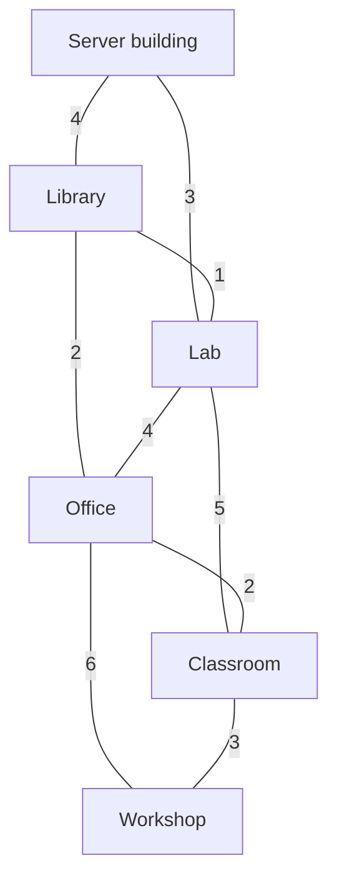
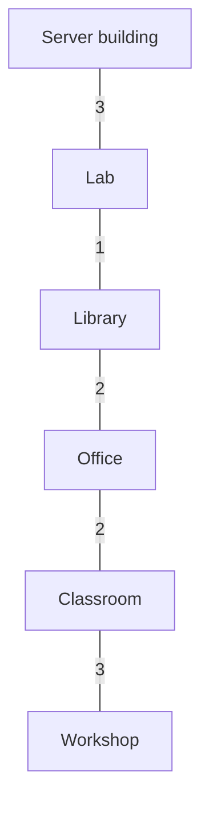

# Minimum spanning tree: connecting a campus

## Problem and prerequisites

Six campus buildings need a cable network. Nine candidate connections have known
installation costs. Choose connections so that every building can communicate
with every other, with **minimum total installation cost**.

## Teaching scope

**In class, only the concept of a minimum spanning tree is mentioned.
Prim's algorithm is not taught. Its steps, correctness argument, implementation
and complexity are not required for the exam.**

The campus network simply illustrates what it means to connect all vertices
with minimum total edge weight. There is no additional algorithmic content
to study for this topic from this example.

The complete Prim implementation is provided as **optional supplementary material**
for anyone curious about how such a tree can be computed. Running the program
does not imply that students must learn that algorithm.

Costs are fictional and expressed in hundreds of euros. Reading the optional
code requires arrays, loops, lists and weighted undirected graphs.

The demo is self-contained: JDK 17 is sufficient, with no libraries or downloads.

## The candidate network



Each undirected edge represents one possible cable, usable in both directions.
Its label is an installation cost, not a distance or a transmission delay.
Installing all nine cables would cost 30 units (3,000 euros).

## The selected tree



Five cables connect all six buildings without a cycle: **6 - 1 = 5 edges**.
Their total is **11 units (1,100 euros)**. The starting building determines the
trace, but the objective is to connect all buildings, not to find routes from
one special source.

## Optional extension: how Prim makes the choice

Keep a set of selected vertices. For each unselected vertex, remember the
cheapest single edge from any selected vertex and the endpoint providing it.
Choose the unselected vertex with the cheapest such edge, add it, and update the
candidate connections. Initially only the server building is selected.

| Step | Edge added | Edge cost | Running total |
| --- | --- | ---: | ---: |
| 1 | Server -- Lab | 3 | 3 |
| 2 | Lab -- Library | 1 | 4 |
| 3 | Library -- Office | 2 | 6 |
| 4 | Office -- Classroom | 2 | 8 |
| 5 | Classroom -- Workshop | 3 | 11 |

Edge costs need not appear in increasing order: adding Lab makes its cheaper
connection to Library available. Each chosen edge crosses from the selected set
to its complement; the lightest edge across that cut is safe for a minimum
spanning tree. Adding a previously unselected vertex cannot introduce a cycle.

`cheapest[v]` is the cost of **one connecting edge**. Unlike Dijkstra's distance,
it is not the sum of costs along a path from the server. The update therefore
uses `cableCost`, not `distance[next] + cableCost`.

## A failed connection and an alternative

The program removes Library -- Lab and recomputes the tree from scratch. The
replacement is Server -- Library, increasing the optimum from 11 to **14 units**.
Restoring the original connection restores the cost of 11.

This is a planning exercise: recomputation assumes that other candidate cables
can be installed or used. A tree by itself has no redundant routes. If one of its
installed edges fails, the tree disconnects. Real availability requirements may
therefore justify extra cables and a larger budget.

## Three different tree objectives

| Tree | Objective |
| --- | --- |
| BFS discovery tree | Minimum hop count from one source in an unweighted graph |
| Dijkstra shortest-path tree | Minimum weighted path cost from one source |
| Minimum spanning tree | Minimum sum of selected edge weights connecting all vertices |

All are trees under their appropriate connectivity assumptions, but the objectives
differ. The MST does not promise the shortest server-to-building routes. This is
also not an implementation of an Ethernet spanning-tree protocol or Internet
routing: the lesson concerns the graph optimisation problem.

## Files and representation

- `src/ds/Network.java`: a simple undirected weighted graph with fixed vertex
  indices and copied device names. The adjacency matrix is symmetric.
- `src/ds/Prim.java`: minimum spanning tree algorithm; its result contains the
  chosen edges in selection order and their total cost.
- `src/app/ExampleNetwork.java`: the six buildings and nine candidate links.
- `src/app/Main.java`: original network, optimum, unavailable link and restoration.
- `tests/tests/ExampleChecks.java`: contracts and independent optimality checks.

The matrix uses **-1 for no edge**, so zero-cost edges remain valid. Negative
costs are deliberately rejected by this installation-cost model; this is a model
restriction, not a general restriction of Prim's algorithm. Vertex count is fixed
when constructing the network. `links()` lists each undirected edge once even
though the matrix stores it twice.

## Contracts and edge cases

- Null name arrays, null/blank/duplicate names, invalid indices and negative
  costs throw `IllegalArgumentException`, using simple explicit checks.
- Name arrays are copied. Names are immutable strings.
- Adding a self-loop or an existing link returns false. Duplicate insertion
  preserves the original cost. Adding or removing a link updates both directions.
- `cost(u, v)` returns -1 if the edge is absent; `removeLink` returns false if absent.
- Empty and singleton graphs return an empty selection with total zero. For the
  empty graph this is a convenient result convention, not a claim that it is a tree.
- A disconnected graph throws `IllegalStateException`: no spanning tree exists.
  A spanning forest would be a different return contract and is not implemented here.
- Costs may equal `Integer.MAX_VALUE`. Totals and pending minimum values use
  `long`, avoiding overflow when summing valid integer edge costs.
- Equal candidate costs are resolved deterministically by vertex index; an
  equally cheap new edge does not replace the first remembered parent.
- The algorithm does not modify the network. Results and edge lists are
  unmodifiable snapshots; later network changes do not alter earlier results.
- Do not modify a network while Prim is running. Result records carry data;
  calling their constructors directly does not certify a valid minimum tree.

## Optional extension: implementation complexity

For V buildings, the matrix occupies **O(V²)** space. Looking up, inserting or
removing a link takes O(1); listing links scans the matrix in O(V²).
The simple duplicate-name check in the constructor also takes O(V²).

Prim chooses the next vertex with a linear scan, then scans its matrix row.
It performs at most V iterations: **O(V²) time**, with **O(V) extra space** for
marks, candidate costs, parents and the resulting tree. A priority queue and
adjacency lists can improve sparse-graph performance, but are unnecessary for
this six-building explanation.

## Run

From this individual demo folder, on Windows:

```powershell
.\run.cmd
.\run.cmd test
```

On macOS or Linux:

```bash
bash run.sh
bash run.sh test
```

The scripts compile with Java 17, all warnings enabled and warnings treated as
errors. Alternatively open this folder in VS Code and run `app.Main`.
From Topic06, use `bash run.sh Demo02NetworkSpanningTree` or
`.\run.cmd Demo02NetworkSpanningTree`.

## Expected output

```text
Campus network: fictional installation costs in hundreds of euros.
Available undirected links (fictional installation cost units):
  Server -- Library : 4
  Server -- Lab : 3
  Library -- Lab : 1
  Library -- Office : 2
  Lab -- Office : 4
  Lab -- Classroom : 5
  Office -- Classroom : 2
  Office -- Workshop : 6
  Classroom -- Workshop : 3
Installing every link: 30

Minimum spanning tree:
  Server -- Lab : 3
  Lab -- Library : 1
  Library -- Office : 2
  Office -- Classroom : 2
  Classroom -- Workshop : 3
Selected links: 5 for 6 nodes
Total cost: 11

Incident: Library -- Lab is unavailable.

Recomputed minimum spanning tree:
  Server -- Lab : 3
  Server -- Library : 4
  Library -- Office : 2
  Office -- Classroom : 2
  Classroom -- Workshop : 3
Selected links: 5 for 6 nodes
Total cost: 14

Link restored:
  Server -- Lab : 3
  Lab -- Library : 1
  Library -- Office : 2
  Office -- Classroom : 2
  Classroom -- Workshop : 3
Selected links: 5 for 6 nodes
Total cost: 11

A tree has no redundant route: one selected link failure disconnects it.
Recomputation assumes the other candidate links are available.
Minimum total installation cost is not minimum latency from the server.
```

## Optional exploration questions (not exam requirements)

1. Why are five edges enough, and why would four be insufficient?
2. Why is the cost-1 edge selected after the cost-3 edge?
3. Why does this tree not necessarily provide shortest paths from the server?
4. What changes if a non-selected edge becomes unavailable?
5. What would you add if communication must survive any one cable failure?
6. What should the program report if every connection to Workshop is removed?

Tests enumerate all edge subsets of size V-1 on small graphs, independently check
connectivity and compare the cheapest total with Prim. They include zero weights,
equal costs, disconnected networks, large integer costs and the incident scenario.
